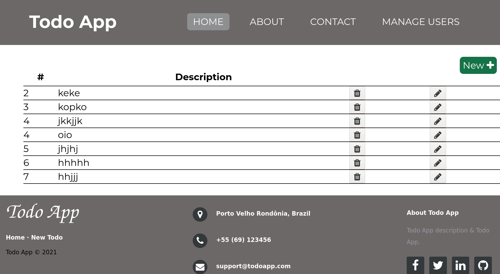

# Todo App

In order to get back to basics with PHP 7, I am developing a whole app that will contain progressively:

  - Basic CRUD ✅
  - MVC ✅
  - Handle files ✅
  - Pure CSS and VanilaJS
  - MariaDB
  - Container
  - Login and Logout
  - File upload
  - CI/CD
  - Docker

